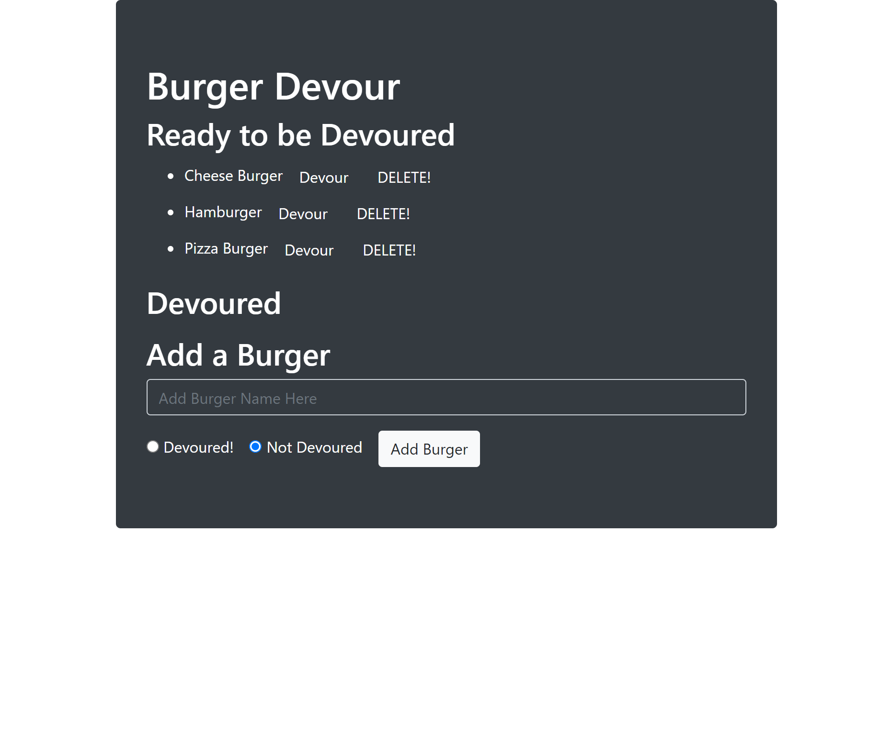

# Devour a Burger!
  
## My story
* This homework enabled me to better understand how you can utlitize Self built ORM methods and save yourself from repeat code!
* I better understand the order of operations when it comes to front end communcating with the back end!
* Can't wait to get started on Sequelize!
## Features ##
* Allow the user to Generate a burger that is devoured or not.
* You may delete a burger 
* You can add and devour as many burgers as you like!
## Installation ##
1. Open up git bash terminal
2. Change directory to desired location (%User Profile%/SourceRepo)
3. Clone the repository (git clone git@github.com:ChristianGoldman/Content-Management-Systems.git)
## Usage ##
1. Open up git bash terminal
2. Change directory to the cloned repo
3. Navigate to the Content-Management-Systems folder
4. In the command line run "npm install"
5. In the config folder, inside the connection.js file change the MySQL connection information to your own personal info
6. Open MySQL workbench
7. Copy and paste Both files db.sql and seed.sql into your MySQL workbench
8. run those files to seed the created database
9. In the commmand line run "node server.js"
10. Open default browser and enter this line into the address bar "localhost:8080/"
11. Add, devour or delete as many burgers as you like!
12. You should see a webpage similar to this!

## Credits ##
* Cwerness gitlab
* https://umn.bootcampcontent.com/University-of-Minnesota-Boot-Camp/uofm-stp-fsf-pt-09-2020-u-c/blob/master/01-Class-Content/13-MVC/04-Important/MySQLHerokuDeploymentProcess.pdf
* http://expressjs.com/en/5x/api.html
* https://www.w3schools.com/js/default.asp
* https://www.mysqltutorial.org/
* https://www.npmjs.com/package/mysql
* Tutor Makism
* BCS learning assistants
* TA's Paul Hendrickson, Tommy Boone, Jake O'Thoole, Daniel Thao
## License ##
    MIT License

    Copyright (c) [2020] [Christian Goldman]

    Permission is hereby granted, free of charge, to any person obtaining a copy
    of this software and associated documentation files (the "Software"), to deal
    in the Software without restriction, including without limitation the rights
    to use, copy, modify, merge, publish, distribute, sublicense, and/or sell
    copies of the Software, and to permit persons to whom the Software is
    furnished to do so, subject to the following conditions:

    The above copyright notice and this permission notice shall be included in all
    copies or substantial portions of the Software.

    THE SOFTWARE IS PROVIDED "AS IS", WITHOUT WARRANTY OF ANY KIND, EXPRESS OR
    IMPLIED, INCLUDING BUT NOT LIMITED TO THE WARRANTIES OF MERCHANTABILITY,
    FITNESS FOR A PARTICULAR PURPOSE AND NONINFRINGEMENT. IN NO EVENT SHALL THE
    AUTHORS OR COPYRIGHT HOLDERS BE LIABLE FOR ANY CLAIM, DAMAGES OR OTHER
    LIABILITY, WHETHER IN AN ACTION OF CONTRACT, TORT OR OTHERWISE, ARISING FROM,
    OUT OF OR IN CONNECTION WITH THE SOFTWARE OR THE USE OR OTHER DEALINGS IN THE
    SOFTWARE.